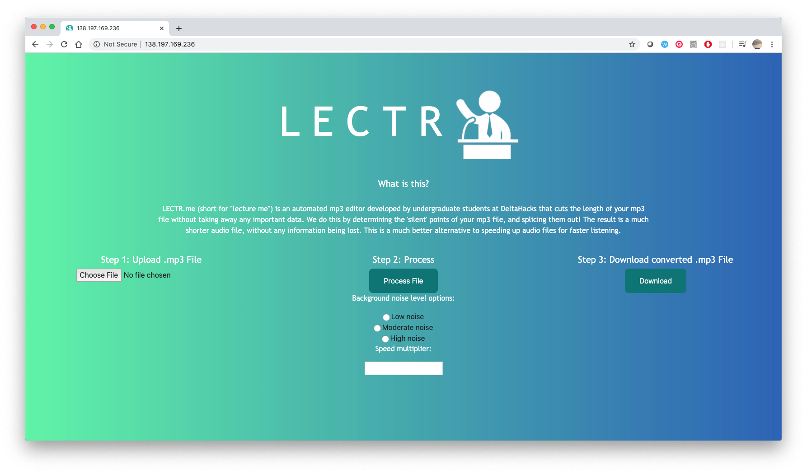

# lectr.me @ Deltahacks VI

This was an exclusively 2-day project created by students at the University of Waterloo and McMaster at Deltahacks VI. Awarded **1st Place: Best Education Hack** at the event, this script is able to compress the length of any `.mp3` audio file by extracting all silent parts.

**Devpost Winning Entry: [devpost.com/software/lectr-me-4nlmxt](devpost.com/software/lectr-me-4nlmxt)**

For more info, see:
*  [Devpost Link](https://devpost.com/software/lectr-me-4nlmxt)
*  [DeltaHacks Devpost Winners](https://deltahacks6.devpost.com/submissions)
*  [DeltaHacks Info](https://www.deltahacks.com/)

## Backstory

As university students, we are constantly facing the challenge of time-management. With the average lecture being [100 hours](https://stack.dailybruin.com/2018/11/08/how-long-are-lectures/), going up to 200 hours for arts students, we're faced with an incredibly small amount of time to complete coursework and have time for ourselves.

Often, students approach this with a simple solution: watch the lecture recordings at home. To save even more time, students often put the lectures on 1.5x, 1.75x or even 2x speed, almost making the lecturer incomprehensible. In addition to that, some students even skip lectures altogether if they deem the content unnecessary for their work (often this is a big mistake).

This is the problem we have solved. Rather than ramp up the speed to 2x, or skip the lecture altogether, lectr.me reduces lecture time by up to 50+% (see below), without reducing any of the content or the quality of audio. Our algorithm detects the silent parts of the audio clip, and snips them out completely.

## Pictures

Here is what the main page of the webapp looks like:


After clicking the "Choose File" button, this appears:


## Demonstration

Here is a sample audio clip run through our script.

Our sample input is this YouTube video [here](https://www.youtube.com/watch?v=BP7Ujbyu-NE). This input video is 50 minutes and 4 seconds long.

After running the script, we get this audio sample [here](./demo/Cut_Lecture.mp3). The output audio file is 22 minutes and 24 seconds long.

Overall, this reduced the length of the clip by 55.3% without speeding up the lecture or losing any content. Give it a listen!

## How it works

Here is an overview of important files within this respository
```
├── audioEditing.py
├── formSubmit.php
├── img
│   ├── LECTR.png
│   ├── background_gradient.jpg
│   ├── cloud_upload.png
│   ├── conversion_arrow.png
│   ├── favicon.png
│   ├── favicon_round.png
│   ├── logo.png
│   ├── logo_small.png
│   └── logo_transparent.png
├── index.css
├── index.php
├── readme.md
└── uploads
    ├── (uploads go here)
```
#### `index.php`

The main webpage, formatted using basic **bootstrap** elements. The audio file is uploaded to the server using a the "multipart/form-data" attribute in the HTML form tag. This stores the audio file in the main directory. After the user selects their parameters in the second section, they can click "**Generate**" to generate their audio file. This runs the **`formSubmit.php`** file, which modifies a `$_SESSION` array variable called **`"cut_file"`** (see the next section). That session variable is the path to the new cut audio clip, which can be downloaded with the Download button.

#### `formSubmit.php`

This is the interface between the webpage and the python script. The file is retrieved using `$_FILES` super global variable, and parameters are taken using the `$_REQUEST` super global variable (since these were submitted via the HTML form). Then, we use `shell_exec()` to call the python script, which returns the path to the cut file, and is stored as a session array variable using `$_SESSION`. After that, the `header()` function is called using `"Location:"` to send the user back to `index.php` seamlessly.

#### `audioEditing.py`
This file uses the [pydub](https://github.com/jiaaro/pydub) library, taking in command line arguments (file path, noise level and speed factor) and returning the path to the shortened audio clip.

#### `index.css`

This includes the styling for the `index.php` page, taking assets from `img/`

## Disclaimer

The lectr.me domain is no longer owned by the project owners, and the website is no longer live.
